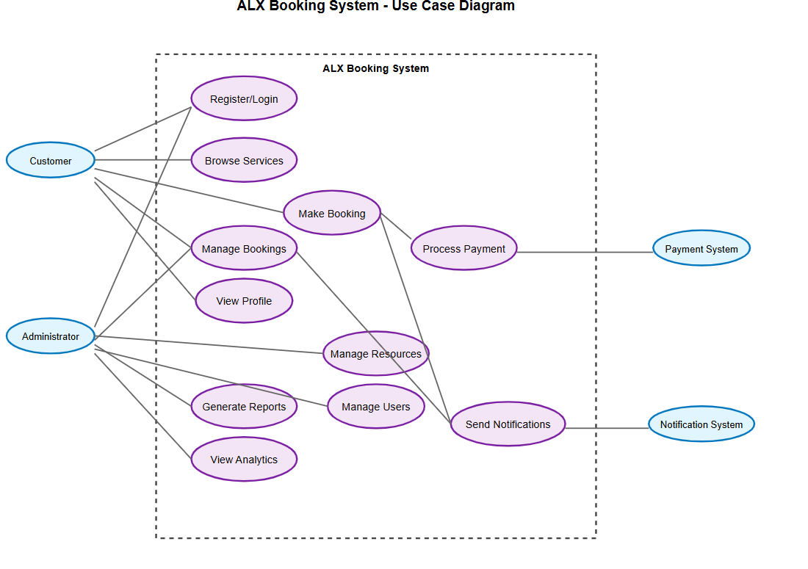

# Requirement Analysis in Software Development

# Requirement Analysis in Software Development

This repository explores the concept of **Requirement Analysis** in the Software Development Lifecycle (SDLC).  
It provides explanations, examples, and diagrams to demonstrate how requirement analysis is applied in real-world projects.

---

## What is Requirement Analysis?

Requirement Analysis is the process of understanding, documenting, and managing the needs and expectations of stakeholders for a software system.  
It plays a crucial role in the **Software Development Lifecycle (SDLC)** because it ensures that developers build the right product.

Key points:

- Helps avoid misunderstandings between clients and developers.
- Acts as the foundation for system design and development.
- Ensures business needs are translated into technical requirements.

---

## Why is Requirement Analysis Important?

1. **Prevents Miscommunication**  
   Ensures developers and stakeholders have a shared understanding of the system.

2. **Saves Time and Costs**  
   Catching errors early reduces expensive fixes later in the project.

3. **Improves Product Quality**  
   Leads to building a system that truly meets user needs.

---

## Key Activities in Requirement Analysis

- **Requirement Gathering** – Collecting raw requirements from stakeholders.
- **Requirement Elicitation** – Using techniques like interviews, surveys, and workshops to refine requirements.
- **Requirement Documentation** – Recording requirements in a structured format.
- **Requirement Analysis and Modeling** – Organizing requirements and representing them using models/diagrams.
- **Requirement Validation** – Checking that requirements align with stakeholder needs and project goals.

---

## Types of Requirements

### Functional Requirements

These describe **what the system should do**.  
Examples for Booking Management System:

- Users should be able to search for available rooms.
- The system should allow users to book a room online.
- The system should send booking confirmation emails.

### Non-Functional Requirements

These describe **how the system should behave**.  
Examples:

- The system should handle 500+ concurrent users.
- Response time for room searches should be less than 3 seconds.
- The system should be available 99.9% of the time.

---

## Use Case Diagrams

Use Case Diagrams show the interactions between actors (users) and the system.  
They help visualize system functionality and user interactions.

---

## Acceptance Criteria

Acceptance Criteria define the conditions that a feature must satisfy to be accepted by stakeholders.  
They make requirements testable and ensure alignment with expectations.

**Example – Checkout Feature in Booking System:**

- The user can review booking details before payment.
- Payment is processed securely using integrated gateways.
- A confirmation email is sent after successful payment.
- The booking status is updated in the system.

---

